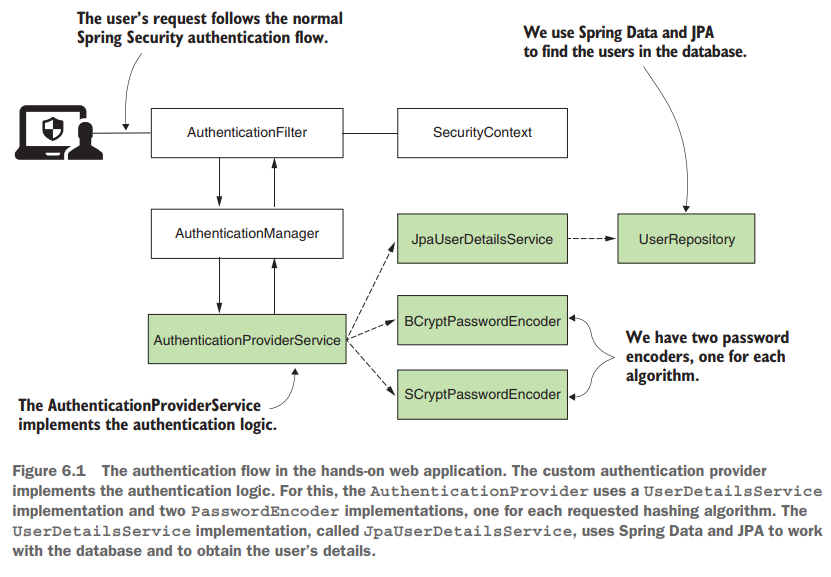
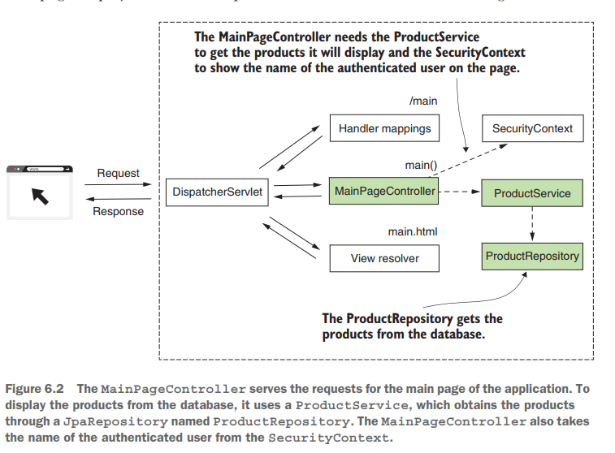
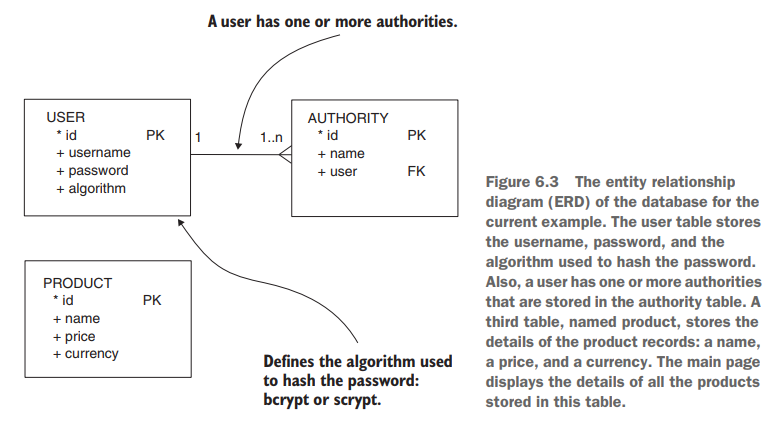

# [Pág. 135] Práctico: una pequeña aplicación web segura







## [Pág. 141] Implementación de la gestión de usuarios

En esta sección, analizamos la implementación de la parte de administración de usuarios de la aplicación. **El
componente representativo de la gestión de usuarios con respecto a Spring Security es UserDetailsService.** Debe
implementar al menos este contrato para indicarle a Spring Security cómo recuperar los detalles de sus usuarios.

## [Pág. 146] Implementación de la lógica de autenticación personalizada

Habiendo completado la administración de usuarios y contraseñas, podemos comenzar a escribir una lógica de autenticación
personalizada. Para hacer esto, debemos implementar un AuthenticationProvider (listado 6.12) y registrarlo en la
arquitectura de autenticación de Spring Security. Las dependencias necesarias para escribir la lógica de autenticación
son la implementación de UserDetailsService y los dos codificadores de contraseña. Además de autoconectarlos, también
anulamos los métodos authenticate() y support().

**Implementamos el método supports() para especificar que el tipo de implementación de autenticación admitida es
UsernamePasswordAuthenticationToken.**

En nuestra clase personalizada **AuthenticationProviderService** que implementa el **AuthenticationProvider**,
agregamos como parte del fragmento de código, la versión moderna del **switch(...)**:

````java

@Service
public class AuthenticationProviderService implements AuthenticationProvider {
    /* more code */
    @Override
    public Authentication authenticate(Authentication authentication) throws AuthenticationException {
        String username = authentication.getName();
        String password = authentication.getCredentials().toString();

        CustomUserDetails customUserDetails = this.userDetailsService.loadUserByUsername(username);

        return switch (customUserDetails.getUser().getAlgorithm()) {
            case BCRYPT -> this.checkPassword(customUserDetails, password, this.bCryptPasswordEncoder);
            case SCRYPT -> this.checkPassword(customUserDetails, password, this.sCryptPasswordEncoder);
            //default -> throw new  BadCredentialsException("Bad credentials");
        };

        //throw new  BadCredentialsException("Bad credentials");
    }
    /* more code */
}
````

En el código anterior comentamos el código que lanza los BadCredentialsException, eso es porque con la moderna
implementación del switch, el flujo no llegará hasta esas líneas. **¿Por qué?**, porque en el switch(), estamos
usando el **Enum EncryptionAlgorithm** y ese enum, tiene exactamente dos posibilidades: **BCRYPT o SCRYPT**.
Lo que significa que si en la BD se cambia el tipo de texto, por ejemplo de un BCRYPT a un ENCRYPT, o cualquier
otro valor que no tengamos definido en el enum EncryptionAlgorithm, al momento de que el Entity User haga el
mapeo con la tabla de la base de datos, ocurrirá un error en tiempo de ejecución.

En nuestra implementación del **AuthenticationProvider**, elegimos el PasswordEncoder que usamos para validar la
contraseña en función del valor del atributo del algoritmo del usuario. En el listado 6.14, encontrará la definición del
método checkPassword(). Este método utiliza el codificador de contraseña enviado como parámetro para validar que la
contraseña sin procesar recibida de la entrada del usuario coincida con la codificación en la base de datos. Si la
contraseña es válida, devuelve una instancia de una implementación del contrato de autenticación. La clase
UsernamePasswordAuthenticationToken es una implementación de la interfaz de autenticación. El constructor al que llamo
en el listado 6.14 también establece el valor autenticado en verdadero. **Este detalle es importante porque sabe que el
método authenticate() de AuthenticationProvider tiene que devolver una instancia autenticada.**

Registrando el AuthenticationProvider dentro de la clase de configuración

````java

@Configuration
public class ProjectConfig extends WebSecurityConfigurerAdapter {
    @Autowired
    private AuthenticationProviderService authenticationProvider;

    @Override
    protected void configure(AuthenticationManagerBuilder auth) throws Exception {
        auth.authenticationProvider(this.authenticationProvider);
    }
    /* more code */
}

````

En la clase de configuración, queremos establecer tanto la implementación de la autenticación en el método formLogin
como la ruta /main como la URL de éxito predeterminada, como se muestra en la siguiente lista. Queremos implementar esta
ruta como la página principal de la aplicación web.

````java

@Configuration
public class ProjectConfig extends WebSecurityConfigurerAdapter {
    /* more code */
    @Override
    protected void configure(HttpSecurity http) throws Exception {
        http.formLogin()
                .defaultSuccessUrl("/main", true);
        http.authorizeRequests().anyRequest().authenticated();
    }
    /* more code */
}

````

## [Pág. 148] Implementando la página principal

Finalmente, ahora que tenemos la parte de seguridad en su lugar, podemos implementar la página principal de la
aplicación. Es una página simple que muestra todos los registros de la tabla de productos. Solo se puede acceder a esta
página después de que el usuario inicie sesión. Para obtener los registros del producto de la base de datos, debemos
agregar una clase de entidad Producto y una interfaz ProductRepository a nuestro proyecto. ``Recordar que hasta
este punto ya tengo implementado cierta parte de la página main con su controlador, su entity y su repository.``

Como ahora ya tenemos la funcionalidad de la autenticación, podemos acceder al **SecurityContext** para obtener
el username autenticado y mostrarlo en el main.html. Esto lo haremos a través del Authentication agregado como parámetro
del método main(...), recordar que Spring hace automáticamente la inyección de dependencia a dicho parámetro del método:

````java

@Controller
public class MainPageController {

    @Autowired
    private ProductService productService;

    @GetMapping(path = "/main")
    public String main(Model model, Authentication authentication) {
        model.addAttribute("username", authentication.getName());
        model.addAttribute("products", this.productService.findAll());
        return "main.html";
    }

}
````

**NOTA**
> Tuve que colocar el @Bean de BCryptPasswordEncoder y del SCryptPasswordEncoder en una clase de configuración aparte,
> porque mostraba un error de dependencia cíclica al estar estos beans dentro de la clase de configuración principal
> de Spring Security ya que se está incluyendo el AuthenticationProviderService que también hace uso de dichos beans.